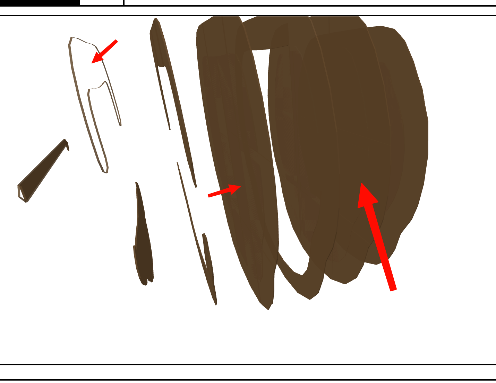

# ObjectSlicer

ObjectSlicer turns 3D models (STL) into flat 2D profiles ready for laser cutting, CNC routing, or interlocking assembly. Pick a slicing style and export nested sheets as SVG.

## What it does

- **Slicing modes** — stacked parallel slices and orthogonal interlocking grids.
- **Notch generation** — automatically cuts material-thickness notches so the parts snap together without glue or fasteners.
- **Nesting** — packs slices onto user-defined sheets with `maxrects-packer` to reduce waste.
- **Export** — generates laser-ready SVGs with cut paths and per-piece labels.
- **Previews** — interactive 3D and 2D previews in the desktop app.

The main interface is an **Electrobun desktop app**. The slicing engine is pure TypeScript/Bun, so there is no Python runtime to install.

## Project layout

```
.
├── src/                     # TypeScript/Electrobun source
├── engine/                  # TypeScript slicing engine
│   ├── slicer.ts
│   ├── spike-b.ts           # stacked-mode test script
│   └── spike-c.ts           # interlocking-mode test script
├── Whale.stl                # example model
└── LICENSE                  # MIT
```

## Requirements

- [Bun](https://bun.sh)
- [hutch](https://electrobun.dev) from the Electrobun tooling

## Quick start

Install dependencies and start the desktop app:

```bash
hutch install
hutch run start
```

The first run builds the front-end assets and launches the desktop window. Use **Pick STL**, choose a mode, set your sheet size, and generate SVG sheets. Try the included `Whale.stl` for a full workflow.

## Screenshots

The controls:


Stacked mode preview:


Interlocking mode preview:


Generated sheets:


Sample SVG output:


Sliced model preview:



## Running the engine from the command line

You can exercise the engine directly with the small test scripts in `engine/`:

```bash
# stacked mode
bun engine/spike-b.ts

# interlocking mode
bun engine/spike-c.ts
```

## Building the desktop app

```bash
hutch run build
```

This produces `build/stable-macos-arm64/ObjectSlicer-stable.dmg` on macOS.

## License

MIT License — see [LICENSE](LICENSE).

## Support

This is the new "FIFY" support model: Fork it, Fix it yourself.

We are all using agents and LLMs to write most actual code these days, so you know what to do if you have an issue.  There are no PRs or Issues in this project.
