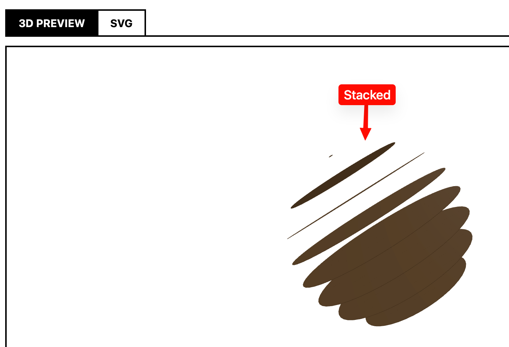
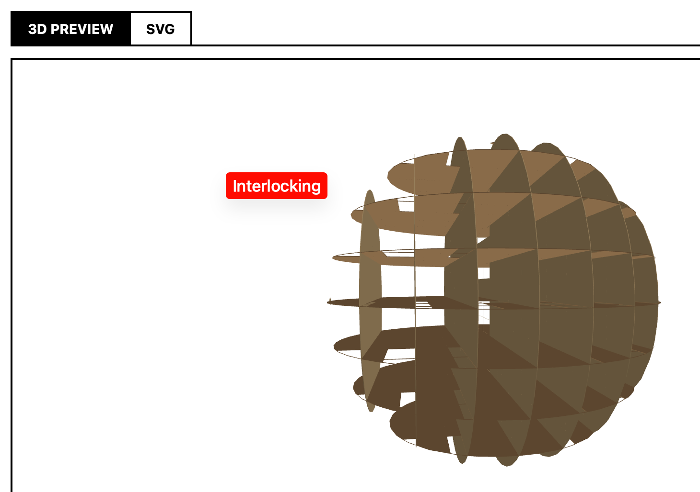
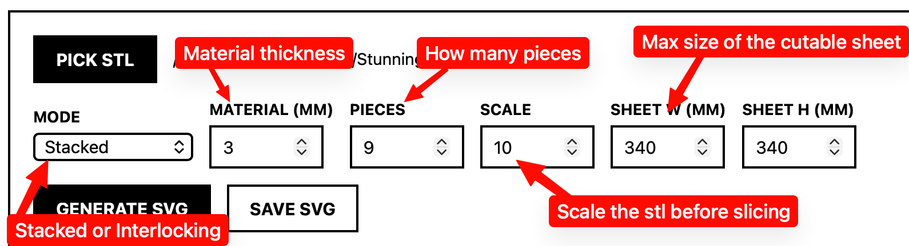
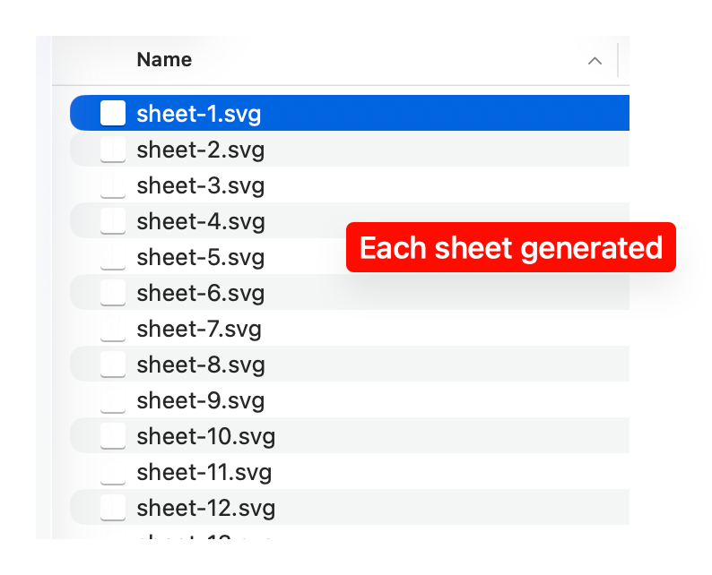
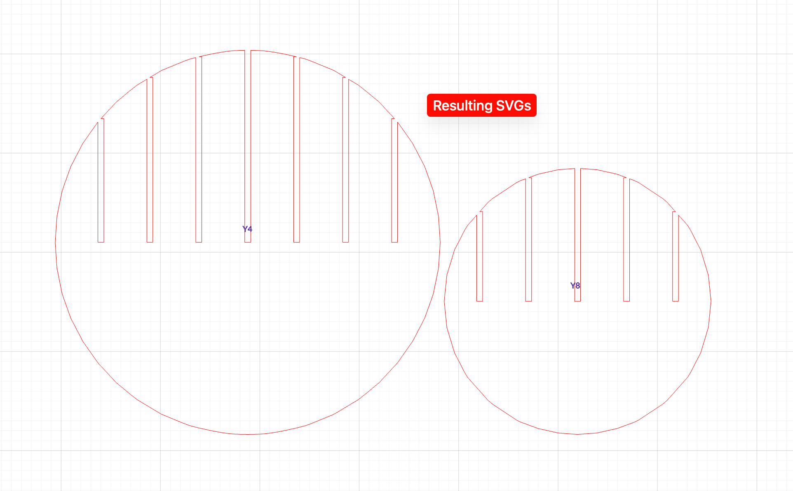

# ObjectSlicer

ObjectSlicer turns a 3D STL model into flat 2D sheets ready for a laser cutter or CNC router. The output is a set of SVG sheets with cut paths, labels, interlocking grooves and packed to fit the material size you pick.

Unlike other options, this is free to use and actually works. It's been proven out on large objects with a variety of shapes. But don't assume all shapes will work perfectly, I've only tested on things I've personally cut.

Source code is on [GitHub](https://github.com/Kikketer/object-slicer).

## Getting started

### Download the app (macOS)

Grab the latest signed and notarized DMG from the [Releases page](https://github.com/Kikketer/object-slicer/releases), open it, and drag ObjectSlicer into your Applications folder. It is signed with a Developer ID and notarized by Apple, so it opens like any other Mac app — no right-click tricks needed.

Apple Silicon Macs only for now.

## The two slicing modes

### Stacked

Stacked mode cuts parallel slices along the Z (height) axis. Each piece is a full cross-section of the model at a different height. You get a neat stack of sheets that you pile in order to recreate the 3D form. It is the classic "layer cake" look. The pieces are not designed to lock to each other, so you can glue them, clamp them, or leave them loose.

### Interlocking

Interlocking mode cuts slices along two perpendicular axes, X and Y. The result is a grid of cross-sections that slot together with material-thickness notches. Every X piece and every Y piece gets half-notches where they meet, so the whole model stands up on its own with no glue or fasteners. The material thickness setting matters here, because the notches are sized to that value.

## How to use it

1. Open the desktop app.
2. Click **Pick STL** and choose a model. The repo includes `Whale.stl` if you want to try it.
3. Choose **Stacked** or **Interlocking**.
4. Set the **material thickness** in millimeters, the number of **pieces/slices**, your **sheet size**, and a **scale** if the model is too big or too small.
5. Click **Generate SVG**.
6. Save the SVG sheets and cut them.

If you prefer the command line, the slicing engine lives in `engine/slicer.ts` and can be called from a small Bun script.

### What the flow looks like

## Expectations

This is not a perfect implementation, and it is not especially clever. It does exactly what I needed, with no upsells and no cost. The geometry handling is simple, the nesting is basic, and there is no hidden roadmap. If it works for you, great. If not, see below.

## Support: FIFIY

This project uses the **FIFIY** model: **Fork it, Fix it Yourself**.

These days the internet is full of agents and LLMs throwing code at repositories. I do not want to spend time triaging issues, reviewing pull requests, or sifting through AI slop to find the one useful change. If you need a fix, a feature, or a different workflow, fork the repo, ask your favorite model to modify it, and keep the result. The source is MIT licensed and is right here.

### Build from source

1. Install [Bun](https://bun.sh) and [Hutch](https://electrobun.dev) from the Electrobun docs.
2. Clone or download the repo from [GitHub](https://github.com/Kikketer/object-slicer).
3. Run `hutch install` then `hutch run start` to launch the app.

This has only been tested on a Mac.
